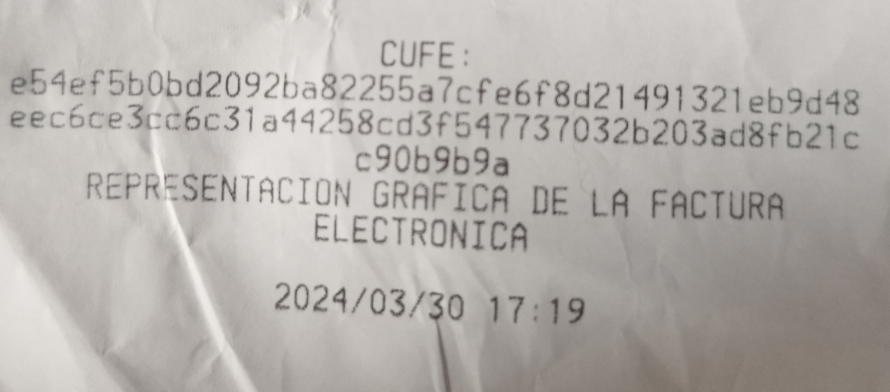
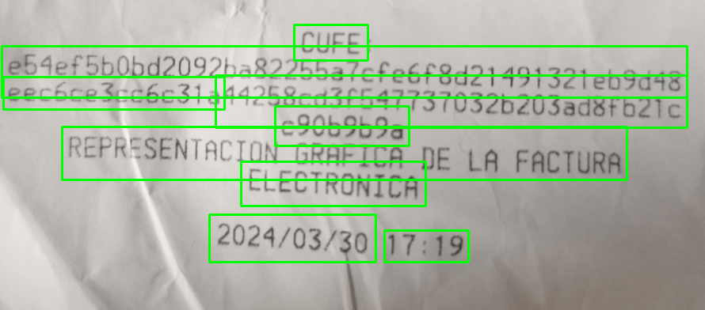

# Easy OCR Flask API

contenidos
<ol>
<li><a href="#Easy-OCR-Flask-API">Easy OCR Flask API</a></li>
<li><a href="#Ejemplo-Uso">Ejemplo Uso</a></li>
<li><a href="#Montaje-en-docker-con-Google-Cloud">Montaje en docker con Google Cloud</a></li>
<li><a href="#Cosas-para-implementar-tal-vez">Cosas para implementar tal vez</a></li>
</ol>

<hr>


Este proyecto consiste en una api del ocr de la biblioteca [EasyOCR](https://github.com/JaidedAI/EasyOCR) la 
cual usa inteligencia artificial para reconocimiento de caracteres.

Para ejecutar el proyecto, se necesita de:
* Python 3.8
* EasyOCR
* Flask 2.0.1
* [poppler](https://github.com/oschwartz10612/poppler-windows/releases/) (para lectura de PDFS, en windows descargar la ultima release 24.02, descomprimir en C y colocar la carpeta bin en variables de entorno), en Linux ejecutar: `sudo apt-get install poppler-utils
`

luego se ejecuta:

``` shell
python3 main.py port=5000
```
y se ingresa al [localhost:5000/ocr](http://127.0.0.1:5000/ocr).
<br>
Si se necesita verificar estado del servicio se ingresa a [localhost:5000/health](http://127.0.0.1:5000/health) el cual imprimirá un json con
``` json
{
    "Status": "Server corriendo bien :)"
}
```

Esta API esta diseñada para enviar peticiones HTTP raw o json y por ahora solo recibe **IMAGENES**. Por ahora el unico endpoint es:


### POST ``/OCR``
Procesa la imagen enviada y devuelve un Json con la imagen en base64 y el texto extraído con su respectiva confianza.

* ### Body requerido
Para la petición POST se requieren exactamente 2 valores en formato json, `archivo`,  `archivo_nombre` y `filetype` , siendo el primero el archivo codificado en base64 y el segundo el nombre del archivo con su extensión.

**Por ahora solo admite archivos de tipo ``PDF`` y ``PNG``** los cuales deben ser enviados en filetype con su . inicial.

* return_images: Es un parametro opcional, está por defecto en false, pero al pasarse True, la API devuelve las imagenes de resultado codificadas en base64.


* ### HEADERS requeridos:
* Authotization: Este valor es un valor plano para autentificacion del usuario que consulta para evitar ataques. Este se encuentra en main.py y debe coincidir. Por defecto es `OGLIT44458OCR32`.
* Content-Type: Este valor debe ser `application/json`, por que es el estandar para la api.
* GUID: Este es un identificador único de la petición, esto para efectos de depuración y creacion de archivos.

Crear la carpeta `input_files` y `outputs`

### GET ``/``
Al hacer un GET en el index (/), este va a retornar url not provided ya que el index funciona para extraer videos de instagram.

Los unicos queries requeridos son:
* url: url del video de instagram, por ejemplo ``https://www.instagram.com/p/C6SjFTOgVTd``
* d: Este valor es **Opcional** por lo que si se envia, es cualquier cosa. Este query es para que redirija al video para descargarlo directamente

<hr>

## Ejemplo Uso

### GET ```/```

Para hacer una peticion y obtener un video de instagram puede hacerse de la siguiente forma.

Abrir el navegador y colocar la url ```http://localhost:5000/?url=https://www.instagram.com/p/C6SjFTOgVTd``` y nos retornará el siguiente json

```json
{
    "data": {
        "filename": "ig-downloader-1714951503.mp4",
        "height": "1920",
        "videoUrl": "https://scontent.cdninstagram.com/v/t66.30100-16/40151049_7443673592382761_7026644123582268717_n.mp4?_nc_ht=scontent.cdninstagram.com&_nc_cat=105&_nc_ohc=gD-kmvp9zzcQ7kNvgFo2gcM&edm=APs17CUBAAAA&ccb=7-5&oh=00_AfAI3lczemjMxEoyMdln_yjAeuvpEzZrrFP91MheIQhCIg&oe=6639FA02&_nc_sid=10d13b",
        "width": "1080"
    },
    "status": "success"
}
```
Mientras que si abrimos la URL ```http://localhost:5000/?url=https://www.instagram.com/p/C6SjFTOgVTd&d=loquesea``` Nos reenviará al url del video obtenido en la misma pestaña, viendo así el video que queremos.


### POST ```/OCR```
En el [archivo petition.md](Documentation/Petition.md) En documentation, se encuentra un CURL de ejemplo en el cual le mandamos la siguiente [imagen](Documentation/factura.png):

Esta se transforma a base 64 ([Base64Guru](https://base64.guru/converter/encode) las codifica en base64 y con [Code Beautify](https://codebeautify.org/base64-to-image-converter) se decodifica para efectos de pruebas).

Finalmente se envia un json así:
```json lines
{
  "archivo": "Base64asjfkdhasujkfasdfjkashgdfasdfbjkasgf",
  "archivo_nombre": "file.png",
  "filetype": ".png"
}
```
Con sus respectivos Headers
```json lines
  --header 'Authorization: OGLIT44458OCR32' \
  --header 'Content-Type: application/json' \
  --header 'GUID: AvSd#eSd3123S' \
  --header 'User-Agent: insomnia/9.1.0' \
```

y nos arroja una respuesta así
```json lines

{
  "data": {
    "pages": {
      "0": {
          "imagen_output": "Base64_con_texto_identificado_Asdjkashfiklaswjgifuhsawdiufjkaswd...", 
        "promedio_confianza": 0.6366935570769906,
          "textos": [
    {
      "confidence": 0.6765828300896995,
      "text": "CUFE"
    },
    {
      "confidence": 0.5185472640909319,
      "text": "e54ef540bd2092ba82255a7cfe6f8d21491321eb9d48"
    },
    {
      "confidence": 0.4558746145922156,
      "text": "eecgce3ccoc31a"
    },
    {
      "confidence": 0.42207323121012874,
      "text": "44258203/5477370326203ad8f621c"
    },
    {
      "confidence": 0.8958780567938724,
      "text": "c90b9b9a"
    },
    {
      "confidence": 0.16475350029594904,
      "text": "REPRESENTACION GRAFICP DE LA FACTURA"
    },
    {
      "confidence": 0.8350578139552077,
      "text": "ELECTRONICA"
    },
    {
      "confidence": 0.9973578790227252,
      "text": "2024/03/30"
    },
    {
      "confidence": 0.7669226532329895,
      "text": "17;19"
    }
  ]


      }
    }
  },
}

```
La imagen que da de output es la siguiente:



## Montaje en docker con Google Cloud

Para el montaje en docker se descarga desde [el sitio oficial](https://www.docker.com/products/docker-desktop/) y bueno siguiente siguiente...

Para crear la imagen se hace con `docker image build -t nombreimagen .` y para ejecutarlo en el docker local se hace un `docker run -p 5000:5000 nombreimagen`
y ya estaría montado, no hay que tocar dockerfile ni requeriments.txt.

Para montarlo en Google cloud nos descargamos el sdk de google cloud lo configuramos segun su [documentacion](https://cloud.google.com/sdk/?authuser=2&hl=es_419) oficial.

Luego ejecutamos 

```shell
gcloud artifacts repositories create nombreRepositorio --repository-format=docker --location=us-central1 --description="descripcion del repositorio"
```
esto para crear el repositorio en Google cloud, podemos hacerlo desde la web pero esto es más rapido. (es posible modificar la location)

luego ejecutamos (lo que va luego de --tag se puede sacar de gcloud ingresando a [artifact registry](https://console.cloud.google.com/artifacts/docker/pdf-processor-api/us-central1/pdfproccesor?project=pdf-processor-api),
ingresando al proyecto que recien hemos creado y en la parte superior podemos copiar la ruta con un boton de portapapeles. el _nombreimagen_ es la imagen que tenemos local y el tag es para identificarlo
en gcloud), si nos pide habilitar las apis, le damos que si y esperamos.

```shell
gcloud builds submit --region=us-central1 --tag us-central1-docker.pkg.dev/id-proyecto-gcloud/nombre-repo/nombreimagen:tagcualquiera

gcloud builds submit --region=us-central1 --tag us-central1-docker.pkg.dev/[PROJECT_ID]/[REPO_NAME]/[IMAGE_NAME]:[TAG]
```
Este comando sube el contenedor docker a nuestro repositorio. Destacando nuevamente que la ruta se peude obtener en google cloud desde [aqui](https://console.cloud.google.com/artifacts?referrer=search&project) ingresando al repositorio y copiando su ruta. Luego de este codigo se carga a la nube

Finalmente se ejecuta:
```shell
gcloud run deploy --image=us-central1-docker.pkg.dev/fair-bearing-414921/easy-ocr-api/easyocrapip:tag1
#esto lo podemos obtener del artifact registri, ejecutamos:, donde lo que esta luego del --image es la ruta que nos da google cloud al ingresar a la seccion de artifact registry y al contenedor
gcloud run deploy --image=us-central1-docker.pkg.dev/[PROJECT_ID]/[REPO_NAME]/[IMAGE_NAME]:[TAG] --port=5000
#ejemplo gcloud run deploy pdfconverter --image=us-central1-docker.pkg.dev/pdf-processor-api/pdfproccesor/pdfconverter-wsgi:production --region=us-central1 --port=5000


```
Nos pedira si queremos habilitar las apis para continuar, le damos Y, y luego nos pide especificar la region, esta tiene que coincidir con la que colocamos en nuestro repositorio, en este caso **[32] us-central1**, de igual forma nos da una lista para decidir.

<hr>

Cosas para implementar tal vez
* Filtros: https://stackoverflow.com/questions/68261703/how-to-improve-accuracy-prediction-for-easyocr
